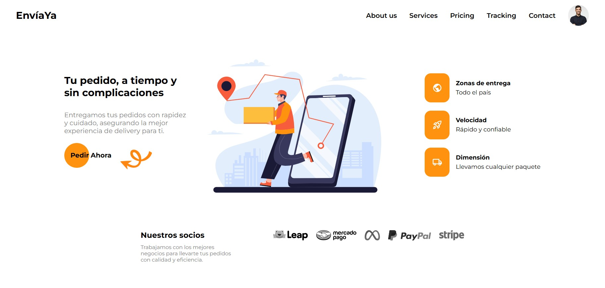

# Landing Page 1

This project is a Landing Page developed with **HTML, CSS, and JavaScript**, inspired by the design on [Dribbble](https://dribbble.com/shots/24339040-Skateboard-landing-page-ui). It is a modern and attractive interface to showcase projects in a personal portfolio.

## 🚀 Technologies Used

- **HTML5** → Semantic and accessible structure.
- **CSS3** → Responsive design, animations, and advanced styling.
- **JavaScript (ES6+)** → Dynamic interactivity on the page.

## 📸 Screenshots

Here is a preview of the landing page:



## 📂 Project Structure

```bash
📁 vanilla-landing-page
├── 📂 assets  # Images, icons, and other resources
├── 📂 css     # CSS stylesheets
├── 📂 js      # Interactivity scripts
├── 📄 index.html  # Main page
└── 📄 README.md   # Documentation
```

## ⚙️ Installation and Usage

1. **Clone the repository**
   ```bash
   git clone https://github.com/your-username/your-repository.git
   ```
2. **Open the `index.html` file in your browser**
3. Explore and customize as needed!

## 📌 Credits

- Design inspired by: [Dribbble](https://dribbble.com/shots/24339040-Skateboard-landing-page-ui)
- Developed by: **Mikaruz**

## 📄 License

This project is under the MIT license. You can freely use and modify it.

---

💡 _If you like this project, don't forget to give it a ⭐ on GitHub!_
